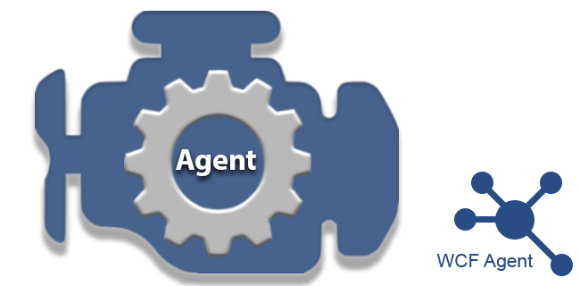

# World Crime Feeds (WCF) - Agent
### By OneFirewall Alliance




## Obtain OneFirewall Certificate
*The use of the WCF Database can be obtained via a certificate which is provided for Threat Intelligence Feeds older than 7 days (community edition), for commercial use please see the [subscriptions plans](https://onefirewall.com/get-started/index.html?tag=github)*

## Install
1. Install the latest version of WCF Agent by OneFirewall
```
wget -O - https://raw.githubusercontent.com/onefirewall/WCF-Agent/master/install.sh | bash
```
2. Login at https://app.onefirewall.com
3. Generate a config.json file which holds a certificate for accessing the World Crime Feeds API

## Run
```
cd  /opt/onefirewall/WCF-Agent-latest
node app reset $(pwd)/config.json    # To reset WCF locally
node app ips $(pwd)/config.json      # To download the latest Threat Feeds
node app ids $(pwd)/config.json      # To push security events from local IDSs
node app db $(pwd)/config.json       # To view the Level DB locally
```

## Crontab
As a root add the below command in crontab 
```
* * * * * cd /opt/onefirewall/WCF-Agent-latest && bash run.sh
```

[onefirewall.com](https://onefirewall.com?tag=github-wcf-agent)
